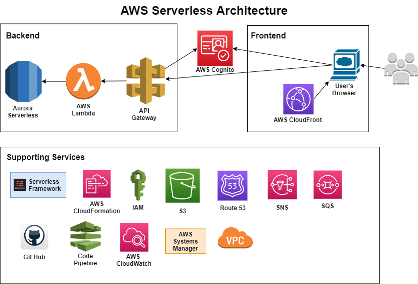

# Cloud Based File Sharing System

## Overview

The Serverless File Sharing Platform is a secure, fully serverless application that enables users to **upload and download files** via a **REST API**. It leverages AWS services like **Lambda, API Gateway, S3, Cognito, and KMS** for **authentication, secure storage, and encryption**. This project eliminates backend infrastructure management while ensuring **scalability and security**.

## Features

- **Serverless Architecture** – No backend servers required
- **Secure File Storage** – AWS S3 with **AWS KMS encryption**
- **Pre-signed URLs** – Time-limited secure access
- **User Authentication** – Managed via **AWS Cognito**
- **Scalability** – Automatically scales with AWS Lambda
- **Easy API Integration** – Works with **Postman, cURL, or a frontend UI**

## Architecture

This project is built using AWS serverless technologies:

- **AWS Cognito** – User authentication and authorization
- **API Gateway** – Exposes RESTful APIs
- **AWS Lambda** – Handles file upload and download requests
- **Amazon S3** – Secure file storage with KMS encryption
- **AWS KMS** – Encrypts and decrypts stored files
- **AWS CloudWatch** – Monitors API requests and logs
  
## Deployment Guide

Follow these steps to deploy the project:

### Step 1: Clone the Repository

### Step 2: Set Up AWS Resources

1. Create an S3 bucket for file storage
2. Enable AWS KMS encryption for secure storage
3. Set up Cognito User Pool for authentication

### Step 3: Configure Environment Variables

Create a `.env` file and add your AWS configurations:
* AWS_REGION=us-east-1
* S3_BUCKET=your-s3-bucket-name
* KMS_KEY_ID=your-kms-key-id
* COGNITO_USER_POOL_ID=your-cognito-user-pool-id
* COGNITO_CLIENT_ID=your-cognito-client-id

### Step 4: Install Dependencies

pip install -r requirements.txt

### Step 5: Deploy the Application
sam build
sam deploy --guided

### Sample API Endpoints

### 1. Upload a File

**Request:**
- POST /files?fileName=<your_file_name>
   Headers:
   Authorization: Bearer <JWT_TOKEN>

**Response:**
- 200 OK – Returns a pre-signed URL for uploading
- 403 Forbidden – Unauthorized access

### 2. Download a File

**Request:**

- GET /files?fileName=<your_file_name>
  Headers:
  Authorization: Bearer <JWT_TOKEN>

**Response:**
- 200 OK – Returns a pre-signed URL for downloading
- 404 Not Found – File does not exist

## Frontend UI Setup

The project includes a simple web UI for interacting with the API.

1. Open `index.html` in a browser
    - The UI allows you to:
        - Upload files to S3
        - Download files from S3

2. Configure `config.js` with API URL

- const CONFIG = {
  API_BASE_URL: "https://<api-id>.execute-api.<region>.amazonaws.com/dev/files"
  };

3. Start a Local Server (Optional)

Run the following command to serve the UI locally:

 - python -m http.server 8000

4. App should be up and running at `http://localhost:8000` in your browser

## License

This project is licensed under the MIT License.

